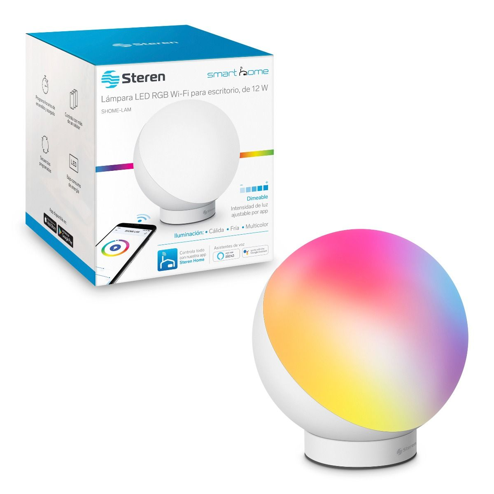
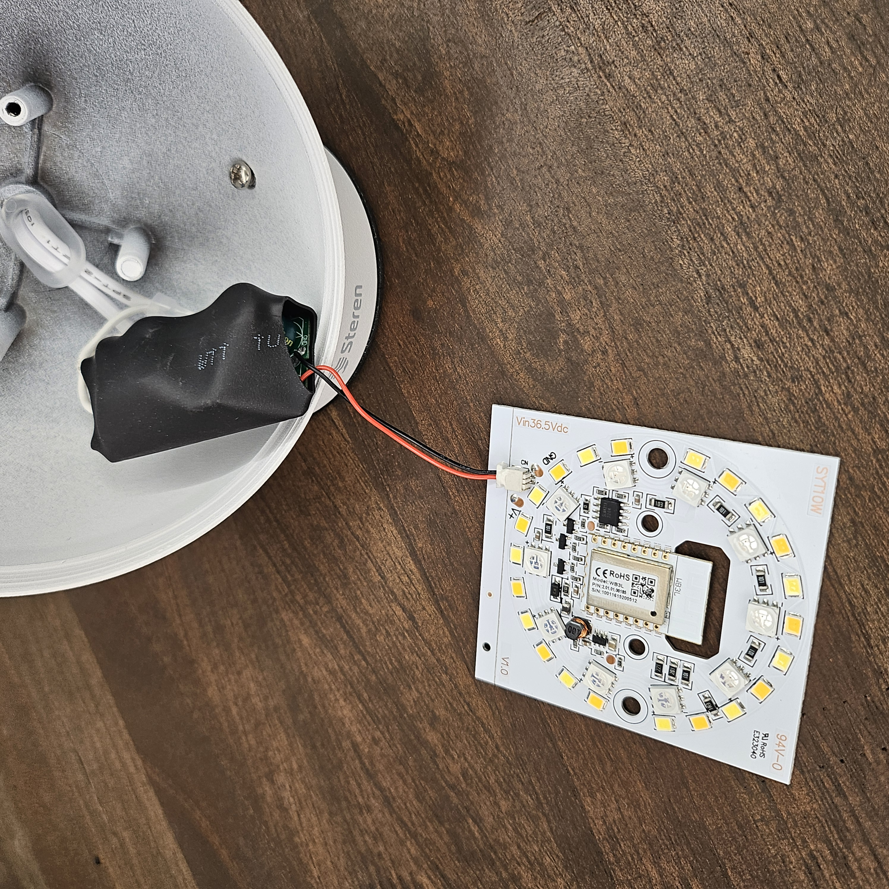
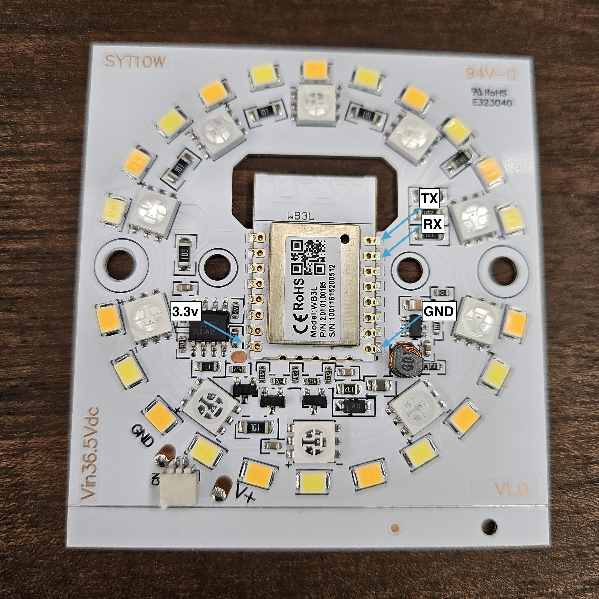

# Steren 12W Multicolor LED Wi-Fi Desk Lamp

The **Steren RGBWW Desk Lamp** is a smart desk lamp with a sleek design, offering RGB color control, dimming, and scene modes. It integrates with Tuya/Smart Life for seamless app control and smart home automation.

I attempted to flash the chip multiple times, but my FTDI adapter couldn’t provide enough current for a successful process. In the end, I followed Digiblur’s Tuya Cloudcutter guide, which is referenced in the ESPHome documentation for BK72xx, and that did the trick.

## Device Details

- **Model**: SHOME-LAM
- **Board**: BK7231 (WB3L variant) 
- **Power**: 12W
- **Link**: [Lámpara LED Wi-Fi\* RGB+W multicolor de 12 W](https://www.steren.com.mx/lampara-led-wi-fi-multicolor-para-escritorio-de-12-w.html)

## Features

- **12W LED Power**: Bright and energy-efficient.
- **RGB Multicolor**: Choose from millions of colors.
- **Dimmable**: Adjustable brightness to fit any mood or task.

## ESP-Compatibility

This lamp uses a BK7231, making it flashable with **ESPHome** .

## Images


_Promotional image from website._


_Unscrew the diffuser. The board is connected to the power source via a connector._


_Internal circuit board showcasing the chipset._

## Pinout and Configuration

### GPIO Mapping

| GPIO | Function   | Description           |
| ---- | ---------- | --------------------- |
| P8   | Red        | RGB LED Red Control   |
| P26  | Blue       | RGB LED Blue Control  |
| P24  | Green      | RGB LED Green Control |
| P6   | Warm White | White LED Control     |
| P7   | Cold White | White LED Control     |

## Flashing Instructions

1. Disassemble the lamp to access the PCB.
2. Identify the microcontroller (e.g., WB2L/BK7231).
3. Flash ESPHome using the configuration below.

### Final YAML Configuration

```yaml
bk72xx:
  board: wb3l

# The product is enclosed in metal.. It might be a good idea to check that it has enough signal.
sensor:
  - platform: wifi_signal
    name: "Signal"
    update_interval: 60s

output:
  - platform: libretiny_pwm
    id: red
    pin: P8
  - platform: libretiny_pwm
    id: blue
    pin: P26
  - platform: libretiny_pwm
    id: green
    pin: P24
  - platform: libretiny_pwm
    id: warm_white
    pin: P6
  - platform: libretiny_pwm
    id: cold_white
    pin: P7

light:
  - platform: rgbww
    name: "Light"
    id: rgb_light
    restore_mode: ALWAYS_OFF
    red: red
    green: green
    blue: blue
    warm_white: warm_white
    cold_white: cold_white
    cold_white_color_temperature: 6500 K
    warm_white_color_temperature: 2000 K
    color_interlock: True
```

## Notes:

The lamp is enclosed in metal, which may affect Wi-Fi signal strength. Ensure it is close to the router or use a repeater if needed.
